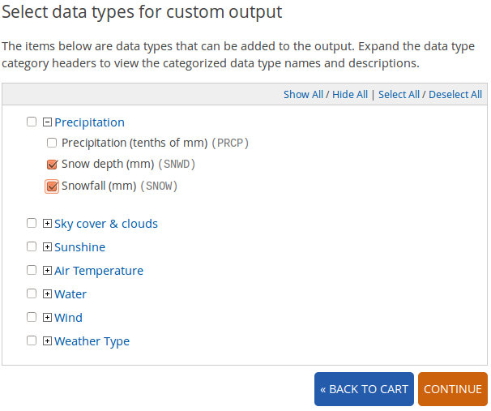

chicago-snow-viz
================

Visualizing historical snowfall levels in Chicago.

## Contents

* [Background](#background)
* [Data Source](#data-source)
  * [Getting The Data](#getting-the-data)
* [Setting Up Your Development Environment](#setting-up-your-development-environment)

## Background

I live in Chicago, and the 2013-2014 winter so far has felt oppressive in its amount of snowfall and how much has stayed on the ground unmelting. It feels like the worst winter I can remember, but I recognize that my perception could be colored by many external factors. This is my attempt to justify, or abolish, my feelings about the winter and to get a longer ranging perspective on what Chicago winters are like.

## Data Source

Where can we get measurements of snowfall in Chicago? The [NOAA](http://www.noaa.gov/) (National Oceanic and Atmospheric Administration) operates an arm called the [NCDC](http://www.ncdc.noaa.gov/) (National Climatic Data Center), which provides free access to climate data sets through their [Climate Data Online](http://www.ncdc.noaa.gov/cdo-web/) service.

We want daily measurements that include snow depth, so we'll use the [GHCN Daily](http://gis.ncdc.noaa.gov/geoportal/catalog/search/resource/details.page?id=gov.noaa.ncdc:C00838) (Global Historical Climatology Network) data set. Documentation on the GHCN Daily data set can be found in [this PDF](http://www1.ncdc.noaa.gov/pub/data/cdo/documentation/GHCND_documentation.pdf).

If you go to the main GHCN Daily page, you will find several ways to access the data and find what you're looking for. We'll use the [text search](http://www.ncdc.noaa.gov/cdo-web/search?datasetid=GHCND), where we'll choose the following selections:


The search results contain a number of stations with "Chicago" in their name, and each result also shows the "Period of Record", or the range of time for which measurements are available for download. Strangely, even though I chose a date range going back to 1964, it shows me weather stations that have far less data than that. I have to scroll through the results examining the Period of Record until I find that [CHICAGO OHARE INTERNATIONAL AIRPORT](http://www.ncdc.noaa.gov/cdo-web/datasets/GHCND/stations/GHCND:USW00094846/detail) has data from 1958-11-01 to the present day.


At the bottom of the station's page, there is an area where you can explore the types of data recorded by this weather station and how complete each type is. We're primarily interested in measurements related to snow, so we click on "Precipitation" to see that there is 98% coverage for SNWD (snow depth) and 99% coverage for SNOW (snowfall). I'm guessing that the last 1-2% may be from non-winter days, but it's still pretty good if it's missing some data from a few days in the winter.


### Getting The Data

Data sets are created on the fly for you and take some time for the system to generate. You specify what data you would like, submit the job to the system with your email address, and a link to the data will be sent to you when it's ready.

To get started, you have to add the station to your data shopping cart with the ADD TO CART button:


Then go to your [shopping cart](http://www.ncdc.noaa.gov/cdo-web/cart) through the link in the top right corner of the site:


We will make sure that the Date Range is still 1964-01-01 to 2014-02-07. Next, choose "Custom GHCN-Daily CSV" for the output format. Then click the CONTINUE button at the bottom of the page:


On the next page there are options for what you want included in the data set. In the "Station Detail & Data Flag Options" area, uncheck all the options. While station name might be interesting, this unnecessarily bloats the file as the station name is redundantly included on every line of the CSV file and we're only querying one station at a time:


In the "Select data types for custom output" area, expand the Precipitation header and check the boxes for Snow depth and Snowfall. Then click the CONTINUE button at the bottom of the page:



Enter your email address where you would like the data download URL to be sent and then click the SUBMIT ORDER button at the bottom of the page:


If you use GMail, the NCDC email may be automatically categorized in the Promotions area. Check in your different email categories if you don't see the email appear immediately in your Inbox. The email will look like this:


There is a link to check the status of the data set generation job. It's mostly useless, since you'll get another email dispatched as soon as it's ready for download. For this particular data set, which I've requested several times over in the process of creating this documentation, I had to wait about 12 minutes to get the download link at non-business hours. This wait will change depending on the number of requests that CDO is currently handling, so be patient.

## Setting Up Your Development Environment

I develop visualizations with [D3js](http://d3js.org/), Data-Driven Documents, a fantastic JavaScript data visualization library that manipulates the [DOM](https://developer.mozilla.org/en-US/docs/DOM) (Document Object Model) using your data as the driver. Check out the list of excellent D3 tutorials [here](https://github.com/mbostock/d3/wiki/Tutorials). 

In order to be able to make changes rapidly and see the effects immediately, I use Python to run a local web server:

```
python -m SimpleHTTPServer 8000
```

I run this from the root of this repository, so if I'm editing `index.html` then I can just browse to [http://localhost:8000/index.html](http://localhost:8000/index.html) to see my changes. As soon as I make changes and save the file, I can refresh the page in my browser to see the result.
